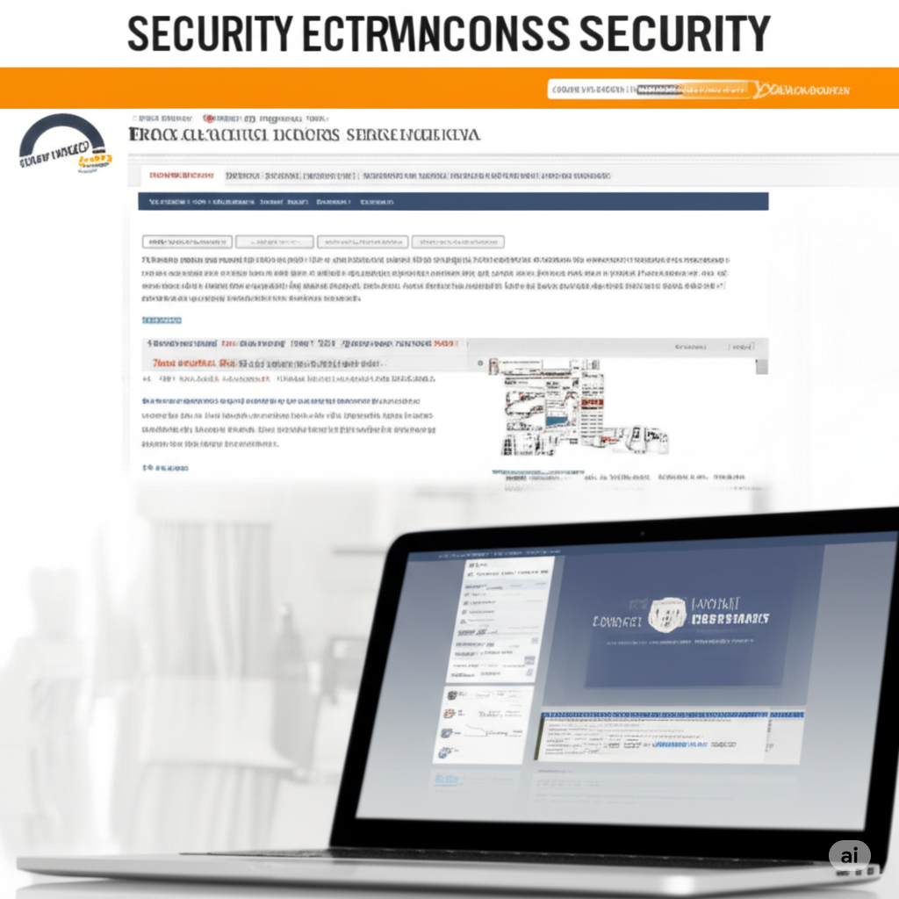

In the digital age, customer data is an invaluable asset for any business, especially in the hospitality industry. Personal information and booking details not only help you provide better service but are also crucial for building long-term customer relationships. However, collecting and storing this data comes with the significant responsibility of protecting it rigorously. A data breach can lead to not only financial losses but also severely damage your reputation and customer trust.

So, how can your hotel booking website ensure the safety of this valuable data? Here are some crucial measures you need to implement:

**Data Encryption:** Apply strong encryption protocols like SSL/TLS to your entire website, especially pages that collect personal and payment information. This transforms data into an unreadable format during transmission, preventing information theft.
**Security Standard Compliance:** If you process credit card information, adhering to the Payment Card Industry Data Security Standard (PCI DSS) is mandatory. This standard includes a set of stringent security requirements to ensure the safety of cardholder data.
**Strict Access Control:** Grant access to customer data only to employees who genuinely need it to perform their duties. Use strong authentication systems and activity logs to monitor all access.
**Regular Software Updates:** Security vulnerabilities are often discovered in software. Regularly updating your website's systems, plugins, and themes is crucial to patch these vulnerabilities and protect against attacks.
**Firewalls and Security Solutions:** Implement robust firewalls to monitor and control traffic entering and leaving your website. Consider using comprehensive web security solutions to detect and prevent potential threats.
**Regular Data Backups:** Perform data backups regularly and store them in a secure location separate from your main system. This ensures that you can recover data in case of unexpected incidents.
**Clear Privacy Policy:** Provide an easy-to-understand and transparent privacy policy that explains how you collect, use, and protect customer data. Ensure this policy is easily accessible on your website.
**Security Awareness Training for Staff:** Ensure your staff is trained on basic security principles, how to recognize common threats (like phishing), and the importance of protecting customer data.
Protecting customer data is not just a legal obligation but also a key factor in building customer trust and loyalty. By prioritizing data security, you are building a solid foundation for the sustainable growth of your hotel.

