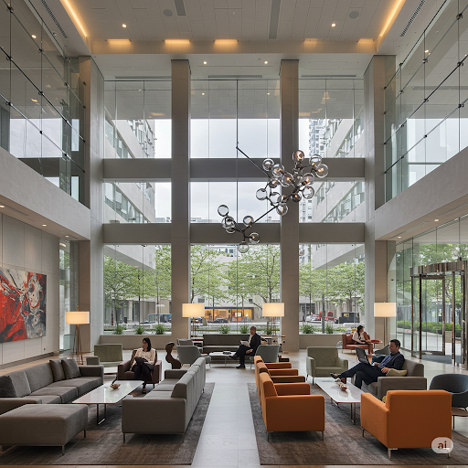

**5 Reasons Why Renting a Booking Website is a Smart Solution for Small Hotels**

In the digital age, having a professional booking website is extremely important for all hotels, especially small ones. However, not every hotel has sufficient resources to build and maintain its own website. That's why renting a booking website has become a smart and effective solution.

**1. Cost Savings**

Building a booking website from scratch requires a significant investment of time and money. You need to hire web designers, programmers, and possibly content managers. This cost can exceed the capabilities of many small hotels. Renting a booking website helps you save this expense, as you only pay a monthly or annual rental fee, which is usually much lower than the cost of building your own website.

**2. Saving Time and Effort**

Managing a booking website requires technical knowledge and time. You need to update room information, prices, process booking requests, and resolve any technical issues that arise. When you rent a website, you usually receive technical support and management from the provider, which helps you save time and effort to focus on managing your hotel and serving your guests.

**3. Professional and Modern Features**

Booking website rental service providers often offer professional and modern features specifically designed for the hotel industry. This includes:

Easy-to-use online booking system.
Detailed and attractive display of room information (high-quality images, full descriptions).
Integration of secure and popular payment methods.
Effective management of room availability and occupancy.
Optimization for mobile devices.
Integration with OTA (Online Travel Agency) channels such as Booking.com, Agoda (optional).
**4. Easy Access to Potential Customers**

A professional booking website helps your hotel easily reach potential customers on the Internet. Nowadays, customers often search for information and book online. Without a website, you will miss out on a large number of potential guests.

**5. Enhancing Reputation and Brand Image**

A well-designed booking website helps enhance your hotel's reputation and brand image. It shows professionalism and reliability, making customers more confident in your services.

Conclusion:

Renting a booking website is a smart and effective solution for small hotels. It helps save costs, time, and effort, while providing professional features, helping you reach potential customers and enhance your brand reputation. If you are looking for a solution to increase revenue and grow your hotel, consider renting a booking website.
