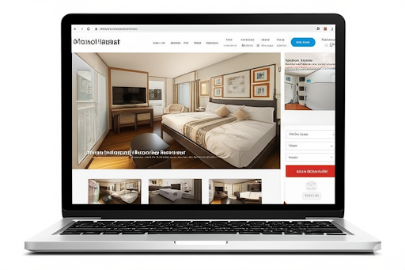

In the digital age, a website is not just an online presence but also a primary sales channel for every hotel. Especially for hotel rental services, a professionally designed, attractive, and user-friendly website plays a pivotal role in attracting customers, increasing booking rates, and building a strong brand. So, what elements make a successful hotel rental website design? Let's explore!

**1. First Impression: Intuitive and Attractive Interface**

Potential customers often form an initial opinion about your hotel within seconds of browsing your website. Therefore, the interface needs to be designed intuitively, modernly, and accurately reflect the style and class of the hotel.

* **High-quality images:** Use sharp, professional photos of rooms, amenities, common areas, and hotel highlights.
* **Clear and easy navigation:** Organize information logically, making it easy for customers to find details about rooms, prices, amenities, and policies.
* **Harmonious colors and fonts:** Choose a color palette and fonts that align with your brand identity, creating a pleasant and professional feel.
* **Responsive design:** Ensure the website displays well on all devices, from desktops and laptops to tablets and smartphones.

**2. Seamless and Convenient Booking Experience**

The online booking function is a vital element of a hotel rental website. The booking process needs to be designed simply, quickly, and securely.

* **Intelligent search and filter system:** Allow customers to easily search for rooms by date, number of guests, room type, price range, and desired amenities.
* **Detailed room information display:** Provide complete information about size, bed type, in-room amenities, diverse images, and clear pricing.
* **Simple booking process:** Minimize unnecessary steps, guiding customers through each step intuitively.
* **Integration of diverse and secure payment methods:** Support payments via credit cards, bank transfers, and popular e-wallets.
* **Instant booking confirmation:** Send confirmation emails or messages immediately after the customer completes the booking.

**3. Providing Detailed and Useful Information**

In addition to room and booking information, the website needs to provide comprehensive and helpful details to give customers a complete picture of the hotel.

* **About the hotel:** History, style, highlights, awards (if any).
* **Information about amenities and services:** Restaurants, bars, swimming pools, spas, gyms, shuttle services, laundry services, etc.
* **Location and directions:** Maps, detailed address, information about nearby attractions and transportation.
* **Hotel policies:** Cancellation policies, check-in/check-out times, regulations regarding children and pets, etc.
* **Contact information:** Phone number, email, address, contact form for customers to easily reach out when needed.

**4. Optimizing User Experience (UX) and User Interface (UI)**

A good website design is not just visually appealing but also provides the best possible experience for users.

* **Fast page loading speed:** Ensure the website loads quickly, avoiding customer impatience.
* **Consistency in design:** Maintain uniformity in colors, fonts, and styles throughout the website.
* **Easy searchability:** Provide a prominent search bar for customers to quickly find the information they need.
* **Clear Call-to-Action (CTA) buttons:** Guide customers to perform desired actions such as "Book Now," "View Details," "Contact Us."

**5. Search Engine Optimization (SEO)**

To attract potential customers from search engines like Google, the website needs to be SEO optimized.

* **Keyword research:** Identify keywords that customers commonly use when searching for hotels.
* **Optimize titles, descriptions, heading tags:** Use relevant keywords naturally.
* **Build quality content:** Provide helpful blog posts about local tourist destinations and travel experiences in the hotel's area.
* **Optimize images:** Use descriptive file names and alt tags containing keywords.

**Conclusion:**

Professional hotel rental website design is a worthwhile investment that brings long-term benefits to your business. By focusing on an attractive interface, seamless booking experience, comprehensive information provision, UX/UI optimization, and SEO, you will create an effective sales channel, attract a large number of customers, and enhance your competitive position in the market. Invest in a quality website design today to reap outstanding successes!

