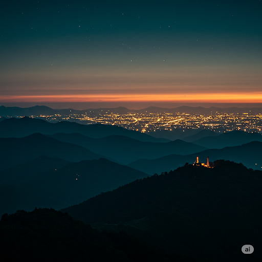

10 Xu Hướng Thiết Kế Website Khách Sạn "Hot Hit" Nhất 2025
Trong bối cảnh ngành du lịch không ngừng đổi mới, website khách sạn không chỉ là nơi cung cấp thông tin mà còn là cầu nối quan trọng tạo ấn tượng đầu tiên và thúc đẩy quyết định đặt phòng của du khách. Năm 2025 chứng kiến sự trỗi dậy mạnh mẽ của những xu hướng thiết kế web mới, mang đến trải nghiệm trực tuyến độc đáo và hấp dẫn hơn bao giờ hết. Hãy cùng khám phá 10 xu hướng thiết kế website khách sạn "hot hit" nhất mà bạn không thể bỏ lỡ!

**1. Thiết Kế Tối Giản (Minimalism) Tinh Tế:**

"Less is more" vẫn là một triết lý thiết kế mạnh mẽ. Năm 2025, các website khách sạn hướng đến sự tối giản trong bố cục, tập trung vào không gian trắng, typography rõ ràng và chỉ giữ lại những yếu tố thực sự cần thiết. Điều này giúp làm nổi bật hình ảnh chất lượng cao và thông tin quan trọng, mang lại trải nghiệm người dùng thanh lịch và dễ chịu.

**2. Dark Mode Sang Trọng và Hiện Đại:**

Giao diện tối (dark mode) không chỉ là một tùy chọn mà đang trở thành xu hướng chủ đạo. Nó mang đến vẻ ngoài sang trọng, hiện đại, giảm mỏi mắt cho người dùng khi duyệt web trong điều kiện ánh sáng yếu và thậm chí có thể tiết kiệm pin cho các thiết bị di động. Các khách sạn đang dần tích hợp dark mode như một tùy chọn hoặc thậm chí là giao diện mặc định.

**3. Storytelling Trực Quan (Visual Storytelling) Cuốn Hút:**

Thay vì chỉ liệt kê thông tin, các website khách sạn năm 2025 tập trung vào việc kể câu chuyện về trải nghiệm mà khách hàng có thể tận hưởng. Sử dụng hình ảnh, video chất lượng cao kết hợp với các đoạn text ngắn gọn, giàu cảm xúc để dẫn dắt người xem khám phá không gian, văn hóa và những khoảnh khắc đáng nhớ tại khách sạn.

**4. Micro-Interactions Tinh Tế:**

Những tương tác nhỏ (micro-interactions) như hiệu ứng hover, animation nhẹ nhàng khi nhấp vào nút hay phản hồi trực quan khi cuộn trang tuy nhỏ nhưng lại có tác động lớn đến trải nghiệm người dùng. Chúng tạo cảm giác sống động, thú vị và cung cấp phản hồi tức thì, giúp người dùng cảm thấy kết nối hơn với website.

**5. Typography Mạnh Mẽ và Cá Tính:**

Năm 2025 chứng kiến sự lên ngôi của typography táo bạo và độc đáo. Việc lựa chọn font chữ cá tính, kích thước và cách sắp xếp chữ sáng tạo không chỉ truyền tải thông tin mà còn góp phần thể hiện bản sắc riêng của thương hiệu khách sạn.

**6. Thiết Kế 3D và Thực Tế Ảo (VR) Sống Động:**

Công nghệ 3D và thực tế ảo ngày càng trở nên phổ biến và dễ tiếp cận. Các khách sạn tiên phong đang tích hợp trải nghiệm 3D ảo cho phép khách hàng "tham quan" phòng ốc, tiện nghi trước khi đặt phòng, mang lại sự tin tưởng và kích thích mong muốn trải nghiệm thực tế.

**7. Cuộn Trang Theo Chiều Dọc (Vertical Scrolling) Mượt Mà:**

Thiết kế cuộn trang theo chiều dọc tiếp tục được ưa chuộng bởi sự trực quan và dễ sử dụng trên mọi thiết bị. Các website khách sạn năm 2025 tận dụng hiệu ứng parallax, animation khi cuộn để tạo sự chuyển động mượt mà và giữ chân người dùng khám phá nội dung.

**8. Nội Dung Cá Nhân Hóa (Personalized Content) Thông Minh:**

Dựa trên dữ liệu người dùng (lịch sử duyệt web, vị trí, sở thích...), các website khách sạn thông minh có khả năng hiển thị nội dung được cá nhân hóa, như các ưu đãi đặc biệt, gợi ý phòng phù hợp hoặc các hoạt động du lịch địa phương mà người dùng có thể quan tâm.

**9. Tích Hợp Trí Tuệ Nhân Tạo (AI) Hỗ Trợ:**

Chatbot AI ngày càng trở nên thông minh và hữu ích trong việc hỗ trợ khách hàng 24/7, trả lời các câu hỏi thường gặp, gợi ý đặt phòng và cung cấp thông tin về dịch vụ. Việc tích hợp AI một cách tự nhiên và thân thiện sẽ nâng cao trải nghiệm người dùng và giảm tải cho đội ngũ nhân viên.

**10. Tính Bền Vững và Trách Nhiệm Xã Hội (Sustainability & Social Responsibility) Thể Hiện:**

Ngày càng nhiều du khách quan tâm đến các vấn đề về môi trường và xã hội. Các website khách sạn năm 2025 có xu hướng thể hiện rõ ràng cam kết về tính bền vững (ví dụ: sử dụng năng lượng tái tạo, giảm thiểu rác thải) và các hoạt động trách nhiệm xã hội, tạo dựng hình ảnh tích cực trong mắt khách hàng.

**Kết Luận:**

Năm 2025 hứa hẹn mang đến những trải nghiệm trực tuyến độc đáo và hấp dẫn hơn cho ngành khách sạn. Việc nắm bắt và ứng dụng những xu hướng thiết kế website mới nhất không chỉ giúp khách sạn của bạn trở nên nổi bật mà còn tạo ra lợi thế cạnh tranh mạnh mẽ, thu hút và giữ chân khách hàng trong kỷ nguyên số đầy năng động này. Hãy sẵn sàng đổi mới và mang đến cho khách hàng những trải nghiệm trực tuyến tuyệt vời nhất!

