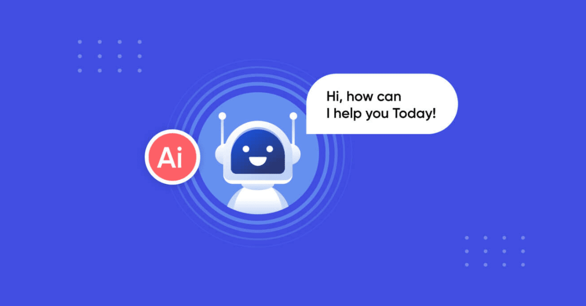

Trong kỷ nguyên số hóa, trải nghiệm khách hàng trực tuyến đóng vai trò then chốt trong sự thành công của mọi doanh nghiệp, đặc biệt là ngành dịch vụ lưu trú. Khách hàng ngày nay mong đợi sự tiện lợi, nhanh chóng và khả năng được hỗ trợ mọi lúc mọi nơi. Đó là lý do tại sao chatbot, hay còn gọi là "trợ lý ảo", đang trở thành một công cụ không thể thiếu trên website của các khách sạn, mang đến giải pháp tăng cường tương tác và hỗ trợ khách hàng 24/7 một cách hiệu quả.

**Chatbot là gì và tại sao nó quan trọng với website khách sạn?**

Chatbot là một chương trình máy tính được thiết kế để mô phỏng cuộc trò chuyện với người dùng thông qua văn bản hoặc giọng nói. Được tích hợp vào website khách sạn, chatbot hoạt động như một nhân viên hỗ trợ ảo, sẵn sàng giải đáp thắc mắc, cung cấp thông tin và hỗ trợ khách hàng mọi lúc, ngay cả khi đội ngũ nhân viên thực tế không có mặt.

**Vậy, tại sao chatbot lại trở nên quan trọng đối với website khách sạn?**

Đáp ứng nhu cầu hỗ trợ 24/7: Khách hàng có thể đến từ khắp nơi trên thế giới với múi giờ khác nhau. Chatbot đảm bảo họ luôn nhận được sự hỗ trợ cần thiết bất kể thời điểm nào.
Tăng cường tương tác: Chatbot tạo ra một kênh giao tiếp trực tiếp và tức thời, khuyến khích khách hàng đặt câu hỏi và tìm hiểu thêm về khách sạn.
Cung cấp thông tin nhanh chóng: Chatbot có thể truy cập và cung cấp thông tin về phòng trống, giá cả, tiện nghi, địa điểm và các chính sách một cách nhanh chóng.
Cá nhân hóa trải nghiệm: Các chatbot thông minh có thể học hỏi từ tương tác trước đó để cung cấp các đề xuất và hỗ trợ phù hợp với từng khách hàng.
Thu thập thông tin khách hàng: Chatbot có thể thu thập thông tin liên hệ và các ưu tiên của khách hàng, giúp khách sạn hiểu rõ hơn về đối tượng mục tiêu.
Giảm tải cho đội ngũ nhân viên: Chatbot có thể xử lý các câu hỏi thường gặp, giải phóng nhân viên để tập trung vào các yêu cầu phức tạp hơn.

**Những tính năng "đáng giá" của chatbot cho website khách sạn:**

**Một chatbot hiệu quả cho website khách sạn có thể sở hữu nhiều tính năng hữu ích, bao gồm:**

Trả lời câu hỏi thường gặp (FAQ): Cung cấp câu trả lời ngay lập tức cho các câu hỏi về giá cả, giờ nhận/trả phòng, tiện nghi, v.v.
Kiểm tra tình trạng phòng trống: Cho phép khách hàng kiểm tra nhanh chóng phòng còn trống theo thời gian mong muốn.
Hỗ trợ đặt phòng: Hướng dẫn khách hàng qua quy trình đặt phòng đơn giản và thuận tiện.
Cung cấp thông tin về địa điểm và hướng dẫn: Chia sẻ thông tin về các điểm tham quan lân cận, phương tiện di chuyển và bản đồ.
Xử lý yêu cầu đặc biệt: Ghi nhận các yêu cầu cụ thể của khách hàng (ví dụ: phòng có giường phụ, tầng cao, v.v.).
Thu thập phản hồi của khách hàng: Sau khi khách hàng tương tác, chatbot có thể thu thập ý kiến đánh giá về trải nghiệm của họ.
Chuyển giao cho nhân viên thực: Trong trường hợp chatbot không thể giải quyết vấn đề, nó có thể chuyển cuộc trò chuyện cho nhân viên hỗ trợ thực tế.
Hỗ trợ đa ngôn ngữ: Tương tác với khách hàng bằng nhiều ngôn ngữ khác nhau, mở rộng phạm vi tiếp cận.

**Lựa chọn và tích hợp chatbot phù hợp cho website khách sạn:**

**Việc lựa chọn chatbot phù hợp là rất quan trọng để đảm bảo hiệu quả. Dưới đây là một số yếu tố cần cân nhắc:**

Xác định mục tiêu:  Bạn muốn chatbot giải quyết những vấn đề gì? Tăng tương tác, hỗ trợ đặt phòng hay cung cấp thông tin?
Ngân sách: Chi phí cho các nền tảng chatbot có thể khác nhau, hãy chọn giải pháp phù hợp với khả năng tài chính của bạn.
Tính năng: Đảm bảo chatbot có các tính năng cần thiết cho nhu cầu của khách sạn bạn.
Khả năng tích hợp: Chatbot cần dễ dàng tích hợp với website và các hệ thống khác (ví dụ: PMS - Property Management System).
Dễ sử dụng và quản lý: Giao diện quản lý chatbot cần thân thiện và dễ dàng để bạn theo dõi và điều chỉnh.
Hỗ trợ kỹ thuật: Chọn nhà cung cấp có dịch vụ hỗ trợ tốt.
Quá trình tích hợp chatbot thường bao gồm việc sao chép và dán một đoạn mã JavaScript vào website của bạn hoặc sử dụng các plugin/ứng dụng tích hợp sẵn nếu bạn sử dụng các nền tảng quản lý website phổ biến.

**Những lưu ý quan trọng khi triển khai chatbot:**

Thiết kế kịch bản trò chuyện chu đáo: Đảm bảo chatbot có thể xử lý các tình huống phổ biến một cách trôi chảy và tự nhiên.
Cá nhân hóa chatbot: Tùy chỉnh giao diện và giọng điệu của chatbot để phù hợp với thương hiệu khách sạn.
Thông báo rõ ràng về sự hiện diện của chatbot: Cho khách hàng biết họ đang tương tác với một trợ lý ảo.
Đảm bảo khả năng chuyển giao cho nhân viên thực: Luôn có phương án để khách hàng có thể liên hệ với nhân viên thực khi cần.
Theo dõi và tối ưu hóa hiệu suất chatbot: Thường xuyên kiểm tra nhật ký trò chuyện để xác định những vấn đề chatbot chưa xử lý tốt và cải thiện kịch bản.
Tương lai của chatbot trong ngành khách sạn:

Công nghệ AI và xử lý ngôn ngữ tự nhiên (NLP) đang phát triển mạnh mẽ, hứa hẹn mang đến những chatbot ngày càng thông minh và tinh tế hơn cho ngành khách sạn. Trong tương lai, chúng ta có thể thấy chatbot có khả năng hiểu ngữ cảnh phức tạp hơn, đưa ra các đề xuất cá nhân hóa sâu sắc hơn và thậm chí hỗ trợ khách hàng bằng giọng nói.

**Kết luận:**

Chatbot "trợ lý ảo" không còn là một xu hướng mới nổi mà đã trở thành một công cụ thiết yếu cho website của các khách sạn muốn nâng cao trải nghiệm khách hàng, tối ưu hóa hoạt động và tăng cường khả năng cạnh tranh. Bằng cách cung cấp hỗ trợ 24/7, tăng cường tương tác và cá nhân hóa trải nghiệm, chatbot đang mở ra một kỷ nguyên mới trong dịch vụ khách hàng trực tuyến cho ngành dịch vụ lưu trú. Hãy bắt đầu khám phá và tích hợp chatbot ngay hôm nay để mang lại những lợi ích vượt trội cho khách sạn của bạn!

